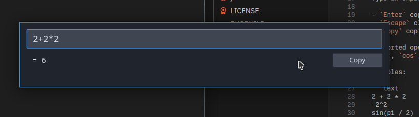

# pemdash

A small calculator overlay with proper operator precedence.



## Install on Arch Linux

```bash
yay -S pemdash
```

## Use

```bash
cargo run --release
```

Type an expression. The result updates as you type.

- `Enter` copies the result and closes pemdash.
- `Escape` closes pemdash.
- `Copy` copies the result without closing.

Supported operators are `+`, `-`, `*`, `/`, and `^`. Constants include `pi`, `e`, and `tau`. Functions include `sqrt`, `sin`, `cos`, `tan`, `abs`, `ln`, `log10`, `min`, `max`, and `pow`.

Examples:

```text
2 + 2 * 2
-2^2
sin(pi / 2)
50 / sqrt(3) * 1e5
max(2, 8, 3)
```

## Bind to Alt+F2 in niri

Build and install the binary somewhere on `PATH`, then add a binding to the `binds` block in `~/.config/niri/config.kdl`:

```kdl
Alt+F2 { spawn "pemdash"; }
```

A floating-window rule is optional:

```kdl
window-rule {
    match app-id="dev.pixelcluster.pemdash"
    open-floating true
}
```
